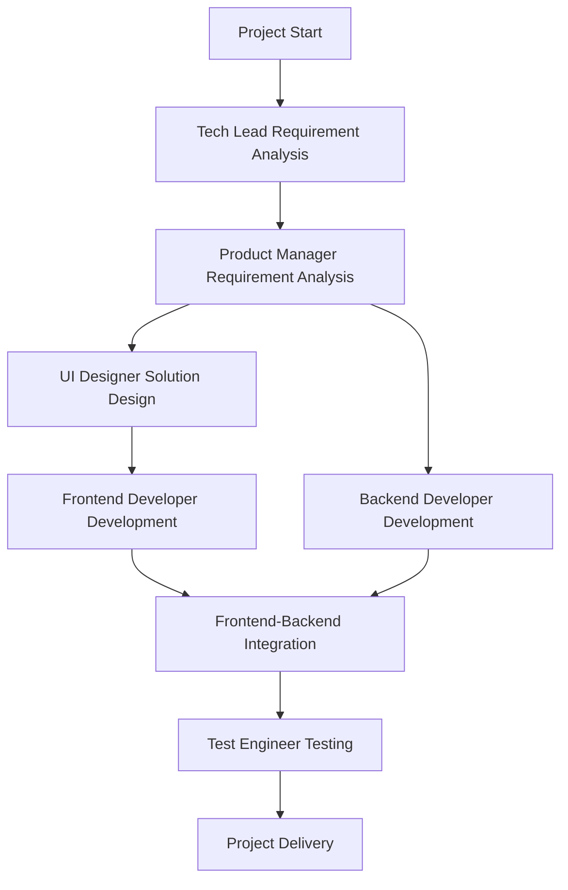

# MCP Package Manager - AI Development Team Management System

> AI development team automation management system based on rule documents and quick start configuration

## 🎯 Project Overview

MCP Package Manager is an intelligent AI development team management system that integrates:

- **AI_DEV_TEAM_PROMPTS.md** - AI development team role definitions
- **DEV_RULES_OPTIMIZED.md** - Development process optimization rules
- **codebuddy_quick_start.md** - Quick start configuration

The system achieves complete development workflow automation management from requirement analysis to testing and delivery through collaboration of six professional AI roles.

**Note**: This project was formerly known as CodeBuddy CN Agent and has been renamed to MCP Package Manager to better reflect its core functionality as an MCP package manager.

## 🏗️ System Architecture

### Core Components

```
MCP Package Manager
├── CLI Interface Layer (src/cli/)
│   └── index.ts - Command line interactive interface
├── Core Engine Layer (src/core/)
│   ├── RoleManager.ts - Role Manager
│   ├── WorkflowEngine.ts - Workflow Engine
│   └── DocumentGenerator.ts - Document Generator
├── Type Definition Layer (src/types/)
│   └── index.ts - TypeScript type definitions
└── Main Entry (src/index.ts)
```

### Technology Stack

- **Runtime**: Node.js + TypeScript
- **CLI Framework**: Commander.js + Inquirer.js
- **Document Processing**: Markdown + Template Engine
- **State Management**: EventEmitter + Map
- **UI Beautification**: Chalk + Progress Bar

## 👥 AI Development Team Roles

### 1. Tech Lead
- **Core Capabilities**: Requirement analysis and breakdown, technology selection, architecture design, task assignment
- **Work Mode**: 15 minutes requirement breakdown + 30 minutes technical solution + task assignment
- **Output Standards**: Requirement breakdown specification, technical architecture solution, task assignment table

### 2. Product Manager
- **Core Capabilities**: KANO model analysis, PRD documents, competitive analysis, MoSCoW priority management
- **Work Mode**: 20 minutes user research + 30 minutes requirement sorting + 2.5 hours PRD writing
- **Output Standards**: User requirement research form, requirement priority list, product requirement document PRD

### 3. UI Designer
- **Core Capabilities**: Visual style design, interaction logic optimization, design specification formulation, multi-end adaptation
- **Work Mode**: 1.5 hours requirement analysis + 2 hours design specification + 2.5 hours sketch + 4 hours high-fidelity design
- **Output Standards**: Design requirement understanding document, basic design specification, page design solution, interaction description document, design delivery list

### 4. Frontend Developer
- **Core Capabilities**: High-fidelity implementation (≥95%), responsive layout, state management, performance optimization, interface integration
- **Work Mode**: 1.5 hours technical solution + 2 hours basic setup + 4-7 hours page development + 2.5 hours interface integration + 2 hours compatibility testing + 1.5 hours performance optimization
- **Output Standards**: Frontend technical solution, core code, frontend development summary report

### 5. Backend Developer
- **Core Capabilities**: System architecture design, database design, RESTful API, performance optimization, security protection
- **Work Mode**: 2.5 hours architecture design + 3.5 hours database design + 2 hours interface design + 6 hours service development + 1.5 hours interface integration + 2 hours performance optimization + 1 hour security hardening
- **Output Standards**: Backend architecture design document, database design specification, API interface document, core business code, backend development summary report

### 6. Test Engineer
- **Core Capabilities**: Test strategy formulation, test case design, functional/performance/compatibility testing, bug management, quality assessment
- **Work Mode**: 2.5 hours test plan + 3 hours case design + 1.5 hours smoke test + 3 hours functional test + 2 hours interface test + 2.5 hours performance test + 2 hours regression test + 1 hour acceptance test
- **Output Standards**: Test plan, test case set, bug list, performance test report, test summary report

## 🚀 Quick Start

### Environment Requirements

- Node.js ≥ 16.0.0
- npm ≥ 7.0.0 or yarn ≥ 1.22.0

### Install Dependencies

```bash
npm install
# or
yarn install
```

### Development Mode

```bash
npm run dev
# or
yarn dev
```

### Build Project

```bash
npm run build
# or
yarn build
```

## 💻 Usage Guide

### 1. Initialize Project

```bash
codebuddy init
```
Interactive collection of project information, creation of project directory structure.

### 2. View Available Roles

```bash
codebuddy roles
```
Display all AI development team roles and their capabilities.

### 3. Activate Role

```bash
codebuddy activate tech-lead
# or
codebuddy activate 技术总监
```
Activate specified role and start professional work.

### 4. Start Workflow

```bash
codebuddy start
```
Start complete AI development team collaboration process.

### 5. Execute Next Step

```bash
codebuddy next
```
Execute the next step of the workflow in sequence.

### 6. View Project Status

```bash
codebuddy status
```
Display project progress, current step, activated roles, and other information.

### 7. Switch Roles

```bash
codebuddy switch product-manager
```
Switch between different roles to adapt to different development stage requirements.

### 8. Generate Documents

```bash
codebuddy docs
```
Automatically generate project documents, progress reports, role work records, etc.

### 9. Get Help

```bash
codebuddy help
```
Display all available commands and usage instructions.

## 📋 Workflow



## 📊 Project Management

### Progress Tracking
- Real-time display of workflow progress percentage
- Detailed step completion status
- Role activation and work history records

### Document Management
- **项目说明文档.md** - Overall project planning
- **进度报告.md** - Real-time progress updates
- **角色工作记录/** - Detailed work logs for each role
- **项目总结报告.md** - Summary after project completion

### Quality Assurance
- Strict role capability verification
- Standardized output specifications
- Complete workflow checks
- Automated document generation

## 🔧 Configuration

### Role Configuration
Role configuration is stored in `RoleManager`, including:
- Basic role information (name, type)
- Core capability list
- Detailed work mode
- Output specification requirements
- Activation prompts
- Workflow definitions

### Workflow Configuration
Workflow steps are defined in `WorkflowEngine`:
- Step ID and name
- Responsible role
- Estimated duration
- Deliverable list
- Prerequisites
- Status management

### Document Templates
Document templates are integrated in `DocumentGenerator`:
- Project specification document template
- Progress report template
- Role work record template
- Project summary report template

## 🎯 Use Cases

### Applicable Scenarios
- 🚀 **New Project Launch** - Quickly establish standardized development processes
- 📱 **Product Iteration** - Systematic requirement analysis and implementation
- 🎨 **UI Redesign** - Professional design-to-development full process
- 🔧 **Technical Refactoring** - Standardized architecture design and implementation
- ✅ **Quality Assurance** - Comprehensive testing and quality control

### Advantages
- ⚡ **Quick Start** - Preset configurations based on best practices
- 🔄 **Process Standardization** - Strict role collaboration and work sequence
- 📊 **Progress Visualization** - Real-time project status and progress display
- 📝 **Document Automation** - Intelligent document generation and management
- 🎨 **User-Friendly** - Intuitive command-line interface and prompts

## 🤝 Contribution Guide

### Development Standards
1. Follow TypeScript strict type checking
2. Use JSDoc format to add Chinese comments
3. Keep code structure clear and modular
4. Write complete error handling logic

### Feature Extensions
- Add new role types and configurations
- Customize workflow steps
- Extend document templates and formats
- Integrate external tools and APIs

## 📄 License

MIT License - See [LICENSE](LICENSE) file for details

## 🆘 Support

If you encounter problems or have feature suggestions, please:

1. Check project documentation and help commands
2. Check log files for error information
3. Submit an Issue in the project

---

**MCP Package Manager** - Make AI development team collaboration more efficient! 🚀
