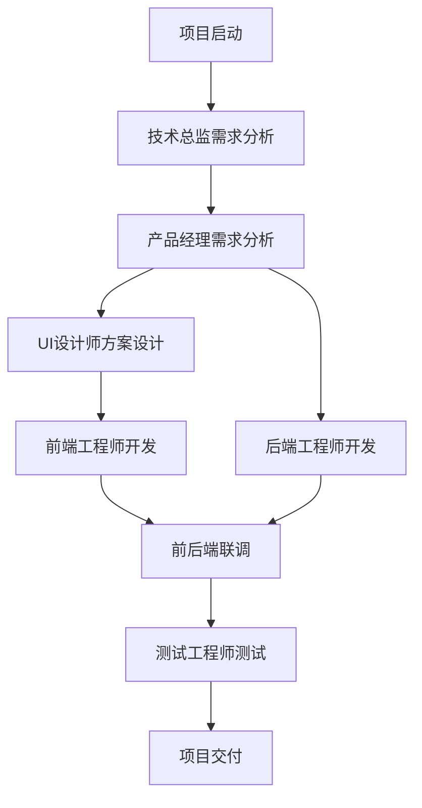

# MCP Package Manager - AI开发团队管理系统

> 基于规则文档和快速启动配置的AI开发团队自动化管理系统

## 🎯 项目概述

MCP Package Manager 是一个智能化的AI开发团队管理系统，它整合了：

- **AI_DEV_TEAM_PROMPTS.md** - AI开发团队角色定义
- **DEV_RULES_OPTIMIZED.md** - 开发流程优化规则  
- **codebuddy_quick_start.md** - 快速启动配置

系统通过六个专业AI角色协作，实现从需求分析到测试交付的完整开发流程自动化管理。

**注意**：本项目原名 CodeBuddy CN Agent，现已更名为 MCP Package Manager，以更好地反映其作为MCP包管理器的核心功能。

## 🏗️ 系统架构

### 核心组件

```
CodeBuddy CN Agent
├── CLI界面层 (src/cli/)
│   └── index.ts - 命令行交互界面
├── 核心引擎层 (src/core/)
│   ├── RoleManager.ts - 角色管理器
│   ├── WorkflowEngine.ts - 工作流引擎
│   └── DocumentGenerator.ts - 文档生成器
├── 类型定义层 (src/types/)
│   └── index.ts - TypeScript类型定义
└── 主入口 (src/index.ts)
```

### 技术栈

- **运行时**：Node.js + TypeScript
- **CLI框架**：Commander.js + Inquirer.js
- **文档处理**：Markdown + 模板引擎
- **状态管理**：EventEmitter + Map
- **UI美化**：Chalk + 进度条

## 👥 AI开发团队角色

### 1. 技术总监 (Tech Lead)
- **核心能力**：需求分析与拆解、技术选型、架构设计、任务分配
- **工作模式**：15分钟需求拆解 + 30分钟技术方案 + 任务分配
- **输出规范**：需求拆解说明书、技术架构方案、任务分配表

### 2. 产品经理 (Product Manager)  
- **核心能力**：KANO模型分析、PRD文档、竞品分析、MoSCoW优先级管理
- **工作模式**：20分钟用户调研 + 30分钟需求梳理 + 2.5小时PRD撰写
- **输出规范**：用户需求调研表、需求优先级清单、产品需求文档PRD

### 3. UI设计师 (UI Designer)
- **核心能力**：视觉风格设计、交互逻辑优化、设计规范制定、多端适配
- **工作模式**：1.5小时需求解析 + 2小时设计规范 + 2.5小时草图 + 4小时高保真设计
- **输出规范**：设计需求理解文档、基础设计规范、页面设计方案、交互说明文档、设计交付清单

### 4. 前端工程师 (Frontend Developer)
- **核心能力**：高还原度实现(≥95%)、响应式布局、状态管理、性能优化、接口对接
- **工作模式**：1.5小时技术方案 + 2小时基础搭建 + 4-7小时页面开发 + 2.5小时接口联调 + 2小时兼容性测试 + 1.5小时性能优化
- **输出规范**：前端技术方案、核心代码、前端开发总结报告

### 5. 后端工程师 (Backend Developer)
- **核心能力**：系统架构设计、数据库设计、RESTful API、性能优化、安全防护
- **工作模式**：2.5小时架构设计 + 3.5小时数据库设计 + 2小时接口设计 + 6小时服务开发 + 1.5小时接口联调 + 2小时性能优化 + 1小时安全加固
- **输出规范**：后端架构设计文档、数据库设计说明书、API接口文档、核心业务代码、后端开发总结报告

### 6. 测试工程师 (Test Engineer)
- **核心能力**：测试策略制定、测试用例设计、功能/性能/兼容性测试、Bug管理、质量评估
- **工作模式**：2.5小时测试计划 + 3小时用例设计 + 1.5小时冒烟测试 + 3小时功能测试 + 2小时接口测试 + 2.5小时性能测试 + 2小时回归测试 + 1小时验收测试
- **输出规范**：测试计划、测试用例集、Bug列表、性能测试报告、测试总结报告

## 🚀 快速开始

### 环境要求

- Node.js ≥ 16.0.0
- npm ≥ 7.0.0 或 yarn ≥ 1.22.0

### 安装依赖

```bash
npm install
# 或
yarn install
```

### 开发模式

```bash
npm run dev
# 或
yarn dev
```

### 构建项目

```bash
npm run build
# 或
yarn build
```

## 💻 使用指南

### 1. 初始化项目

```bash
codebuddy init
```

交互式收集项目信息，创建项目目录结构。

### 2. 查看可用角色

```bash
codebuddy roles
```

显示所有AI开发团队角色及其能力。

### 3. 激活角色

```bash
codebuddy activate tech-lead
# 或
codebuddy activate 技术总监
```

激活指定角色，开始专业工作。

### 4. 启动工作流程

```bash
codebuddy start
```

启动完整的AI开发团队协作流程。

### 5. 执行下一步

```bash
codebuddy next
```

按顺序执行工作流程的下一步。

### 6. 查看项目状态

```bash
codebuddy status
```

显示项目进度、当前步骤、激活角色等信息。

### 7. 切换角色

```bash
codebuddy switch product-manager
```

在不同角色间切换，适应不同开发阶段需求。

### 8. 生成文档

```bash
codebuddy docs
```

自动生成项目文档、进度报告、角色工作记录等。

### 9. 获取帮助

```bash
codebuddy help
```

显示所有可用命令和使用说明。

## 📋 工作流程



## 📊 项目管理

### 进度跟踪
- 实时显示工作流进度百分比
- 详细的步骤完成状态
- 角色激活和工作历史记录

### 文档管理
- **项目说明文档.md** - 项目总体规划
- **进度报告.md** - 实时进度更新
- **角色工作记录/** - 各角色详细工作日志
- **项目总结报告.md** - 项目完成后总结

### 质量保障
- 严格的角色能力验证
- 标准化的输出规范
- 完整的工作流程检查
- 自动化的文档生成

## 🔧 配置说明

### 角色配置
角色配置存储在 `RoleManager` 中，包含：
- 角色基本信息（名称、类型）
- 核心能力列表
- 详细工作模式
- 输出规范要求
- 激活提示词
- 工作流程定义

### 工作流配置
工作流步骤定义在 `WorkflowEngine` 中：
- 步骤ID和名称
- 负责角色
- 预计时长
- 交付物清单
- 前置条件
- 状态管理

### 文档模板
文档模板集成在 `DocumentGenerator` 中：
- 项目说明文档模板
- 进度报告模板
- 角色工作记录模板
- 项目总结报告模板

## 🎯 使用场景

### 适用场景
- 🚀 **新项目启动** - 快速建立标准化开发流程
- 📱 **产品迭代** - 系统化的需求分析和实现
- 🎨 **UI改版** - 专业的设计到开发全流程
- 🔧 **技术重构** - 规范化的架构设计和实现
- ✅ **质量保障** - 全面的测试和质量控制

### 优势特点
- ⚡ **快速启动** - 基于最佳实践的预设配置
- 🔄 **流程标准化** - 严格的角色协作和工作顺序
- 📊 **进度可视化** - 实时的项目状态和进度展示
- 📝 **文档自动化** - 智能的文档生成和管理
- 🎨 **交互友好** - 直观的命令行界面和提示

## 🤝 贡献指南

### 开发规范
1. 遵循TypeScript严格类型检查
2. 使用JSDoc格式添加中文注释
3. 保持代码结构清晰和模块化
4. 编写完整的错误处理逻辑

### 功能扩展
- 新增角色类型和配置
- 自定义工作流程步骤
- 扩展文档模板和格式
- 集成外部工具和API

## 📄 许可证

MIT License - 详见 [LICENSE](LICENSE) 文件

## 🆘 支持

如遇到问题或有功能建议，请：

1. 查看项目文档和help命令
2. 检查日志文件获取错误信息
3. 在项目中提交Issue

---

**CodeBuddy CN Agent** - 让AI开发团队协作更高效！🚀
=======
# mcp-package-manager
Agent 是一个智能化的AI开发团队管理系统
>>>>>>> 25bd1b9b6ffed7f8d6904b728f92ee3680c69e4d
